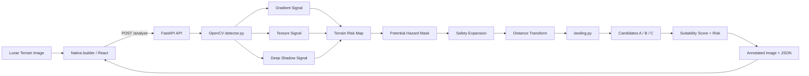

# LunarSafe AI

**LunarSafe AI** is a computer-vision decision-support prototype for analyzing lunar terrain imagery, identifying potential visual hazards, and ranking candidate landing zones.

The project was built for the **AI Factory / Native.builder Hackathon**.

> **Current MVP:** explainable classical computer vision with OpenCV.  
> LunarSafe AI is an experimental prototype, not a flight-certified landing system, and it does not claim scientifically precise crater or obstacle classification.

---

## Overview

Lunar landing imagery can contain strong shadows, abrupt intensity changes, complex terrain boundaries, and visually irregular regions that may make landing-site selection difficult.

LunarSafe AI transforms a lunar terrain image into an explainable analysis containing:

- a potential-hazard map;
- an expanded safety mask;
- a distance-to-hazard analysis;
- three ranked landing candidates;
- a relative suitability score;
- a LOW / MODERATE / HIGH risk classification;
- an annotated result image;
- structured JSON analysis data.

The objective is not to replace real spacecraft guidance systems. The project demonstrates how an interpretable computer-vision pipeline can support visual landing-zone analysis.

---

## How It Works

```text
Lunar terrain image
        ↓
Native.builder / React frontend
        ↓
POST /analyze
        ↓
FastAPI backend
        ↓
OpenCV terrain analysis
        ↓
Gradient + texture + shadow signals
        ↓
Continuous terrain-risk map
        ↓
Potential-hazard mask
        ↓
Safety expansion
        ↓
Distance Transform
        ↓
Candidate landing zones A / B / C
        ↓
Relative suitability score + risk
        ↓
Annotated image + JSON response
```

---

## 1. Image Upload

The user uploads lunar terrain imagery through the frontend.

Supported formats:

- JPEG
- PNG
- WebP

The frontend sends the image to:

```text
POST https://lunarsafe-ai.onrender.com/analyze
```

using `multipart/form-data`.

The API also accepts two mission parameters:

```text
craft_size
safety_margin
```

Supported craft sizes:

```text
small
medium
large
```

Supported safety margins:

```text
low
standard
high
```

---

## 2. Potential-Hazard Detection

The backend uses an explainable classical computer-vision pipeline implemented with OpenCV.

The current detector performs:

1. grayscale conversion;
2. CLAHE local contrast enhancement;
3. Gaussian smoothing;
4. Sobel gradient analysis;
5. local texture-variation analysis;
6. deep-shadow detection;
7. weighted fusion of the visual signals;
8. creation of a continuous terrain-risk map;
9. thresholding into a binary potential-hazard mask;
10. morphological cleanup of the final mask.

### Signal fusion

The current prototype combines three image-space signals:

```text
Gradient signal    55%
Texture signal     30%
Shadow signal      15%
```

These are engineering heuristic weights.

They are **not probabilities** and are not intended to represent scientifically measured terrain risk.

Deep shadows are explicitly preserved as potential hazards even when their gradient or texture contribution is relatively weak.

### Important terminology

A detected region represents a:

> **potential visual hazard**

It does **not** mean that LunarSafe AI has scientifically confirmed a crater, rock, physical slope, or other real-world obstacle.

---

## 3. Safety Expansion

After the initial potential-hazard mask is generated, detected regions are expanded with a configurable safety margin.

This prevents a candidate landing point from being selected immediately beside a detected hazard.

Image borders are also treated as unsafe because terrain outside the image cannot be evaluated.

---

## 4. Resolution-Aware Mission Parameters

The prototype performs analysis in image space.

Instead of using the same fixed pixel dimensions for every image, mission parameters are normalized relative to the image resolution.

For example, with the **Medium** craft configuration:

```text
1000 × 1000 image → craft radius 30 px
474 × 296 image   → craft radius 9 px
```

With the **Standard** safety margin:

```text
1000 × 1000 image → safety margin 10 px
474 × 296 image   → safety margin 3 px
```

The same approach is used for:

- craft radius;
- safety margin;
- border exclusion;
- candidate separation;
- local scoring radius.

This makes the image-space behavior more consistent across different input resolutions.

> These values are still measured in **pixels**. LunarSafe AI does not assume meters-per-pixel information when physical scale metadata is unavailable.

---

## 5. Distance Transform

After hazards and safety margins are established, LunarSafe AI creates a safe-region mask.

OpenCV's:

```python
cv2.distanceTransform()
```

is then used to calculate the distance of safe pixels from the nearest potential-hazard boundary.

A larger distance means that the candidate has more image-space clearance from detected hazards.

---

## 6. Landing Candidate Selection

The algorithm searches the distance map for strong candidate landing locations.

Before a point can become a candidate, the complete configured craft footprint must fit inside the safe region.

The algorithm then:

1. finds the strongest available point;
2. records it as Site A;
3. suppresses a surrounding region;
4. searches again for Site B;
5. repeats the process for Site C.

This prevents all three candidates from appearing almost on top of each other.

The result is a ranked set:

```text
Site A
Site B
Site C
```

---

## 7. Relative Suitability Score

Each landing candidate receives a score from `0` to `100`.

The score combines:

- clearance beyond the minimum craft footprint;
- local potential-hazard density.

Current weighting:

```text
Clearance component       75%
Local safety component    25%
```

The clearance component uses soft saturation so very large clear regions do not immediately collapse into identical `100/100` scores.

The value should therefore be interpreted as a:

> **relative heuristic suitability score**

and not as a probability that a spacecraft will land successfully.

---

## Risk Classification

The current score-to-risk mapping is:

```text
80–100  → LOW
60–79   → MODERATE
0–59    → HIGH
```

These categories are prototype decision-support labels rather than aerospace-certified risk levels.

---

## Current Features

- Lunar terrain image upload
- JPEG / PNG / WebP support
- FastAPI backend
- OpenCV terrain analysis
- CLAHE contrast normalization
- Sobel gradient analysis
- Local texture analysis
- Deep-shadow-aware hazard detection
- Continuous visual risk map
- Potential-hazard mask
- Configurable craft size
- Configurable safety margin
- Resolution-aware image-space parameters
- Distance Transform analysis
- Three ranked landing candidates
- Relative suitability scoring
- LOW / MODERATE / HIGH risk labels
- Original image view
- Hazard Map view
- Distance Map view
- Landing Zones view
- Annotated A / B / C visualization
- Edge-aware landing-site labels
- Structured JSON analysis output
- Download Analysis JSON functionality
- Deployed backend on Render

---

## Example Analysis

### Example 1 — 1000 × 1000 image

Mission configuration:

```text
Craft size:      Medium
Safety margin:   Standard
```

Production API result:

```text
Image size:       1000 × 1000 px
Hazard regions:   288
Craft radius:     30 px
Safety margin:    10 px

Site A
Score:            64 / 100
Risk:             MODERATE
Clearance:        66.77 px

Site B
Score:            58 / 100
Risk:             HIGH
Clearance:        57.14 px

Site C
Score:            55 / 100
Risk:             HIGH
Clearance:        52.74 px
```

### Example 2 — 474 × 296 image

Using the same mission configuration:

```text
Craft size:      Medium
Safety margin:   Standard
```

the image-space parameters are automatically normalized:

```text
Image size:       474 × 296 px
Hazard regions:   90
Craft radius:     9 px
Safety margin:    3 px

Site A
Score:            86 / 100
Risk:             LOW
Clearance:        48.79 px

Site B
Score:            86 / 100
Risk:             LOW
Clearance:        48.18 px

Site C
Score:            84 / 100
Risk:             LOW
Clearance:        40.97 px
```

The two examples demonstrate why raw pixel parameters cannot simply remain constant across different image resolutions.

---

## Architecture



---

## Tech Stack

### Frontend

- Native.builder
- React
- TypeScript
- Vite

### Backend

- Python
- FastAPI
- Uvicorn

### Computer Vision

- OpenCV
- NumPy

### Deployment

- Render
- GitHub

---

## API

### Base URL

```text
https://lunarsafe-ai.onrender.com
```

---

### Health Check

```http
GET /health
```

Response:

```json
{
  "status": "ok"
}
```

---

### Analyze Image

```http
POST /analyze
```

Content type:

```text
multipart/form-data
```

Fields:

```text
file
craft_size
safety_margin
```

Example:

```bash
curl -X POST \
  "https://lunarsafe-ai.onrender.com/analyze" \
  -F "file=@moon.jpg" \
  -F "craft_size=medium" \
  -F "safety_margin=standard"
```

---

## Example API Response

```json
{
  "success": true,
  "image_width": 1000,
  "image_height": 1000,
  "hazard_regions": 288,
  "mission_parameters": {
    "craft_size": "medium",
    "craft_radius_px": 30,
    "safety_margin": "standard",
    "safety_margin_px": 10
  },
  "best_site": {
    "rank": 1,
    "label": "A",
    "x": 902,
    "y": 282,
    "clearance_px": 66.77,
    "craft_radius_px": 30,
    "score": 64,
    "risk": "MODERATE"
  },
  "landing_candidates": [
    {
      "rank": 1,
      "label": "A",
      "x": 902,
      "y": 282,
      "clearance_px": 66.77,
      "craft_radius_px": 30,
      "score": 64,
      "risk": "MODERATE"
    }
  ],
  "annotated_image": "data:image/jpeg;base64,..."
}
```

The actual `landing_candidates` array can contain up to three ranked candidates.

---

## Project Structure

```text
lunarsafe-ai/
├── app/
│   ├── __init__.py
│   ├── detector.py
│   ├── landing.py
│   ├── main.py
│   └── visualization.py
├── .gitignore
├── requirements.txt
├── test_detector.py
├── test_landing.py
└── README.md
```

Local development may also include test imagery and generated debug/output directories that are not part of the tracked production source tree.

---

## Run the Backend Locally

### 1. Clone the Repository

```bash
git clone https://github.com/Sen2x/lunarsafe-ai.git
cd lunarsafe-ai
```

### 2. Create a Virtual Environment

Linux / WSL / macOS:

```bash
python3 -m venv .venv
source .venv/bin/activate
```

Windows PowerShell:

```powershell
python -m venv .venv
.venv\Scripts\Activate.ps1
```

### 3. Install Dependencies

```bash
pip install -r requirements.txt
```

### 4. Start the API

```bash
uvicorn app.main:app --reload
```

### 5. Open API Documentation

```text
http://127.0.0.1:8000/docs
```

---

## Deployment

The backend is deployed as a Render Web Service.

Build command:

```bash
pip install -r requirements.txt
```

Start command:

```bash
uvicorn app.main:app --host 0.0.0.0 --port $PORT
```

Health-check endpoint:

```text
/health
```

Production API:

```text
https://lunarsafe-ai.onrender.com
```

The Native.builder frontend communicates directly with the deployed FastAPI backend.

---

## Explainability

LunarSafe AI is designed to expose intermediate stages rather than showing only one final score.

The interface allows users to inspect:

- the original terrain image;
- detected potential hazards;
- the distance/safety representation;
- candidate landing locations;
- alternative sites;
- clearance values;
- relative suitability scores;
- risk classifications.

This makes the prototype easier to inspect, compare, debug, and demonstrate.

---

## Limitations

The current hackathon MVP has deliberate limitations:

- It uses classical computer vision rather than a trained lunar-terrain segmentation model.
- Hazard detection is heuristic.
- Visual gradients do not directly represent physical terrain slope.
- Texture variation does not directly measure physical roughness.
- Deep shadows are treated as potential hazards but are not physical object classifications.
- A detected region is not equivalent to a scientifically verified crater or rock.
- Clearance is measured in image pixels unless physical scale metadata is provided.
- Craft sizes are relative image-space configurations, not real spacecraft dimensions.
- The system does not currently model spacecraft dynamics.
- The system does not currently model approach velocity.
- The system does not currently calculate real illumination geometry.
- The suitability score is heuristic and relative.
- The risk classification is not aerospace-certified.
- LunarSafe AI is not intended for autonomous operational spacecraft guidance.

---

## Future Work

Potential extensions include:

- trained lunar-terrain segmentation models;
- crater / rock / shadow / flat-terrain classes;
- labeled lunar-terrain evaluation datasets;
- physical meters-per-pixel metadata;
- real terrain elevation data;
- slope and roughness estimation;
- illumination-angle modeling;
- mission-specific spacecraft dimensions;
- spacecraft dynamics;
- multi-image comparison;
- improved safety heatmaps;
- confidence calibration;
- automated benchmark evaluation;
- structured downloadable mission reports.

---

## Why This Approach?

For the hackathon MVP, an explainable classical-CV pipeline provides several advantages:

- each processing stage can be visualized;
- the reasoning is inspectable;
- the system runs without a large trained model;
- behavior can be debugged quickly;
- candidate ranking can be explained;
- image-space assumptions and limitations can be stated explicitly.

The architecture can later be extended with trained segmentation or detection models without replacing the entire decision-support workflow.

---

## Links

- **Backend API:** https://lunarsafe-ai.onrender.com
- **GitHub Repository:** https://github.com/Sen2x/lunarsafe-ai

The published frontend and demo-video links should be added here once their final public URLs are available.

---

## Team

LunarSafe AI was developed collaboratively for the hackathon.

### Sen2x

**Computer Vision / Backend**

- hazard-detection pipeline;
- OpenCV terrain analysis;
- landing-zone selection;
- distance-transform analysis;
- candidate scoring;
- resolution normalization;
- FastAPI integration;
- Render backend deployment.

GitHub:

```text
https://github.com/Sen2x
```

### DaniilsLukaMiskins

**Frontend / UX / Native.builder**

- frontend interface;
- UX implementation;
- Native.builder integration.

GitHub:

```text
https://github.com/DaniilsLukaMiskins
```

### RizskajaVecna

**Testing / Documentation / Demo Features**

- testing;
- documentation support;
- demo support;
- comparison functionality;
- Download Analysis JSON functionality.

GitHub:

```text
https://github.com/RizskajaVecna
```

---

## Disclaimer

LunarSafe AI is an experimental hackathon prototype created for computer-vision research, visualization, and decision-support demonstrations.

It is **not** intended for operational spacecraft guidance, autonomous flight control, scientific terrain certification, or real mission safety certification.