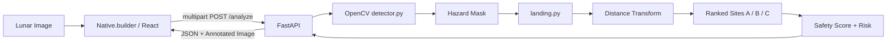

# LunarSafe AI

**LunarSafe AI** is a computer-vision decision-support prototype for analyzing lunar terrain imagery, identifying potential visual hazards, and ranking safer candidate landing zones.

The project was built for the **AI Factory / Native.builder Hackathon**.

> **Current MVP:** explainable classical computer vision with OpenCV.  
> It is **not** a flight-certified landing system and does **not** claim scientifically precise crater classification.

---

## Overview

Lunar landing imagery can contain strong shadows, crater edges, abrupt terrain changes, and visually complex regions that may be unsuitable for a landing attempt.

LunarSafe AI turns a lunar surface image into:

- a potential hazard map;
- a distance/safety visualization;
- three ranked landing candidates;
- a Safety Score and risk level;
- an explanation of why the best site was selected.

The goal is to provide an interpretable visual workflow for experimenting with autonomous landing-site selection logic.

---

## How It Works

```text
Lunar image
    ↓
Native.builder / React frontend
    ↓
POST /analyze
    ↓
FastAPI backend
    ↓
OpenCV hazard detection
    ↓
Hazard mask + safety margin
    ↓
Distance Transform
    ↓
Landing candidates A / B / C
    ↓
Safety Score + risk ranking
    ↓
Annotated result in the UI
```

### 1. Image upload

The user uploads a lunar terrain image through the Native.builder frontend.

The image is sent as `multipart/form-data` to:

```text
POST https://lunarsafe-ai.onrender.com/analyze
```

The upload field name is:

```text
file
```

### 2. Hazard detection

The backend uses OpenCV to analyze the image.

The current detector uses an explainable classical-CV pipeline including:

- grayscale conversion;
- Gaussian blur;
- Canny edge detection;
- morphological filtering;
- contour filtering by area;
- detection of large deep-shadow regions.

The output is a **potential hazard mask**.

Important: a detected region is a **potential visual hazard**, not a guaranteed physical crater or obstacle classification.

### 3. Safety margin

Detected hazard regions are expanded with a safety buffer.

The image borders are also treated as unsafe so the algorithm does not select landing points too close to unknown terrain outside the frame.

### 4. Distance Transform

OpenCV's `distanceTransform` is used to estimate how far each safe pixel is from the nearest hazard.

Points farther from detected hazards receive a higher clearance value.

### 5. Landing-site ranking

The algorithm selects the strongest candidate first, then suppresses a surrounding area so the next candidate is not placed too close to the previous one.

This produces three distinct candidates:

- Site A
- Site B
- Site C

### 6. Safety Score

The heuristic Safety Score combines:

- clearance from the nearest hazard;
- local hazard density around the candidate.

The current scoring logic gives more weight to hazard clearance.

Risk levels are mapped to:

- `LOW`
- `MODERATE`
- `HIGH`

---

## Current Features

- Lunar image upload
- Real FastAPI backend integration
- OpenCV-based hazard analysis
- Deep-shadow-aware hazard handling
- Potential hazard map
- Configurable mission/safety parameters
- Original image view
- Hazard Map view
- Distance Map view
- Landing Zones view
- Three ranked landing candidates
- Safety Score
- Risk classification
- Explainability for the best site
- Annotated landing-site visualization
- Permanent backend deployment on Render

---

## Example Analysis

One current test image produced:

```text
Image size:       619 × 495 px
Hazard regions:   34
Landing sites:    3

Best site:        A
Safety Score:     82 / 100
Risk:             LOW
Clearance:        93.6 px
```

Results depend on the uploaded image and selected mission parameters.

Clearance is currently measured in **pixels**, because the input image does not necessarily contain physical scale metadata.

---

## Architecture



---

## Tech Stack

### Frontend

- Native.builder
- React
- TypeScript
- Vite

### Backend

- Python
- FastAPI
- Uvicorn

### Computer Vision

- OpenCV
- NumPy
- Pillow

### Deployment

- Render
- GitHub

---

## API

### Base URL

```text
https://lunarsafe-ai.onrender.com
```

### Health check

```http
GET /health
```

Example response:

```json
{
  "status": "ok"
}
```

### Analyze image

```http
POST /analyze
```

Content type:

```text
multipart/form-data
```

Field:

```text
file
```

Example with `curl`:

```bash
curl -X POST \
  "https://lunarsafe-ai.onrender.com/analyze" \
  -F "file=@moon.jpg"
```

The response contains information such as:

```json
{
  "success": true,
  "image_width": 619,
  "image_height": 495,
  "hazard_regions": 34,
  "best_site": {
    "rank": 1,
    "label": "A",
    "clearance_px": 93.6,
    "score": 82,
    "risk": "LOW"
  },
  "landing_candidates": [],
  "annotated_image": "data:image/jpeg;base64,..."
}
```

---

## Project Structure

```text
lunarsafe-ai/
├── app/
│   ├── main.py
│   ├── detector.py
│   ├── landing.py
│   └── visualization.py
├── data/
│   ├── test/
│   └── results/
├── test_detector.py
├── test_landing.py
├── requirements.txt
└── README.md
```

---

## Run the Backend Locally

### 1. Clone the repository

```bash
git clone https://github.com/Sen2x/lunarsafe-ai.git
cd lunarsafe-ai
```

### 2. Create a virtual environment

Linux / WSL / macOS:

```bash
python3 -m venv .venv
source .venv/bin/activate
```

Windows PowerShell:

```powershell
python -m venv .venv
.venv\Scripts\Activate.ps1
```

### 3. Install dependencies

```bash
pip install -r requirements.txt
```

### 4. Start the API

```bash
uvicorn app.main:app --reload
```

### 5. Open the API documentation

```text
http://127.0.0.1:8000/docs
```

---

## Deployment

The backend is deployed as a Render Web Service.

Build command:

```bash
pip install -r requirements.txt
```

Start command:

```bash
uvicorn app.main:app --host 0.0.0.0 --port $PORT
```

Health check:

```text
/health
```

The Native.builder frontend communicates with the deployed Render API.

---

## Limitations

The current hackathon MVP has several deliberate limitations:

- It uses classical computer vision rather than a trained lunar-terrain segmentation model.
- Hazard detection is heuristic and depends on image contrast, edges, morphology, and shadows.
- A detected hazard region is not equivalent to a scientifically verified crater or rock.
- Clearance is expressed in pixels unless physical image scale metadata is available.
- The current system does not calculate real-world terrain slope, roughness, illumination angle, or spacecraft dynamics.
- The Safety Score is an interpretable heuristic ranking metric, not an aerospace-certified safety value.

---

## Future Work

Potential next steps include:

- trained lunar terrain segmentation/detection models;
- explicit crater, rock, shadow, and flat-terrain classes;
- real physical scale metadata;
- multi-region comparison mode;
- improved distance/safety heatmaps;
- downloadable structured analysis reports;
- integration with larger lunar datasets;
- mission-specific spacecraft constraints;
- evaluation against labeled terrain data.

---

## Why Explainability Matters

LunarSafe AI is designed so the user can inspect the reasoning behind the selected landing zone.

Instead of showing only a final score, the interface exposes:

- detected hazard regions;
- distance/safety visualization;
- alternative candidates;
- clearance from the nearest hazard;
- risk level;
- the reason Site A ranked above Sites B and C.

This makes the prototype easier to test, debug, and evaluate.

---

## Links

- Backend API: https://lunarsafe-ai.onrender.com
- GitHub: https://github.com/Sen2x/lunarsafe-ai
- Public frontend: **ADD AFTER NATIVE.BUILDER PUBLISH**
- Demo video: **ADD BEFORE HACKATHON SUBMISSION**

---

## Team

LunarSafe AI was developed collaboratively for the hackathon.

Before submission, add the real team members and their actual contributions here, for example:

```text
https://github.com/Sen2x — Computer Vision / Backend
https://github.com/DaniilsLukaMiskins 2 — Frontend / UX / Native.builder
https://github.com/RizskajaVecna —  / Testing / Documentation / Demo / Comparison Mode, Download Analysis JSON functionality
```

Use only contributions that were actually performed by each team member.

---

## Disclaimer

LunarSafe AI is an experimental hackathon prototype for computer-vision research, visualization, and decision-support demonstrations. It is not intended for operational spacecraft guidance or real mission safety certification.
